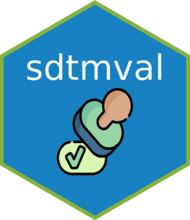

<!-- README.md is generated from README.Rmd. Please edit that file -->

```{r, include = FALSE}
knitr::opts_chunk$set(
  collapse = TRUE,
  comment = "#>",
  fig.path = "man/figures/README-",
  out.width = "100%"
)
```

# sdtmval <a href="https://skgithub14.github.io/sdtmval/"></a>

<!-- badges: start -->

[](https://github.com/skgithub14/sdtmval/actions/workflows/R-CMD-check.yaml) [](https://app.codecov.io/gh/skgithub14/sdtmval?branch=master)

<!-- badges: end -->

{sdtmval} provides a set of tools to assist statistical programmers in validating Study Data Tabulation Model (SDTM) domain data sets. 

Many data cleaning steps and SDTM processes are used repeatedly in different SDTM domain validation scripts. Functionalizing these repetitive tasks allows statistical programmers to focus on coding the unique aspects of a SDTM domain while standardize their code base across studies and domains. This should lead to fewer bugs and improved code readability too. {sdtmval} features include:

-   Automating the BLFL, DY, EPOCH, SEQ, and STAT methods to create new variables

-   Imputing and formatting full and partial dates: see [`vignette("Dates")`](https://skgithub14.github.io/sdtmval/articles/dates.html)

-   Comparing QC versus production SDTM domain tables (vignette coming soon)

-   Applying specification data such as variable labels, lengths, code mapping, and sorting

-   Importing EDC and SDTM data from .csv and .sas7bdat files

-   Writing .xpt files (convenience wrapper for `haven::write_xpt()`)

-   Converting .Rmd files to .R scripts (convenience wrapper for `knitr::purl()`)

-   Logging R session information for reproducibility

-   Data formatting


## Installation

You can install the development version of {sdtmval} from [GitHub](https://github.com/) with:

``` r
# install.packages("devtools")
devtools::install_github("skgithub14/sdtmval")
```

<br>

------------------------------------------------------------------------

## A typical work flow example

In this example work flow, we will import a raw EDC table and transform it into a SDTM domain table. We will use the made-up domain 'XX' along with some example data included in {sdtmval}.

```{r set-up, message=FALSE}
# set-up
library(sdtmval)
library(dplyr)

domain <- "XX"

# set working directory to location of sdtmval package example data
work_dir <- system.file("extdata", package = "sdtmval")
```

The majority of the data needed is in the EDC form/table xx.csv. There are also visit dates in the EDC table vd.csv and study start/end dates in the SDTM table dm.sas7dbat. These can be imported using `read_edc_tbls()` and `read_sdtm_tbls()`. 

```{r import}
# read in EDC tables from the forms XX and VD
edc_tbls <- c("xx", "vd")
edc_dat <- read_edc_tbls(edc_tbls, dir = work_dir)

# read in SDTM domain DM
sdtm_tbls <- c("dm")
sdtm_dat <- read_sdtm_tbls(sdtm_tbls, dir = work_dir)
```

The raw data looks like this:

```{r show-raw, echo=FALSE}
edc_dat$xx %>%
  mutate(across(.cols = everything(),
                ~ stringr::str_replace_all(., " ", "&nbsp;"))) %>%
  knitr::kable()
```

The next thing we will do is get the relevant information from the SDTM specification for the study. The next set of functions assumes there is a .xlsx file which contains the sheets: 'Datasets', 'XX', and 'Codelists':

- 'XX' gives the variable information for the made-up XX domain. `get_data_spec()` retrieves this entire tab.

- 'Datasets' contains the key variables by domain. `get_key_vars()` retrieves the these for desired `domain`.

- 'Codelists' provides a table of coded/decoded values by variable for all domains. `get_codelist()` extracts a data frame of coded/decoded values from this sheet just for the variables in desired `domain`.

```{r spec}
spec_fname <- "spec.xlsx"
spec <- get_data_spec(domain = domain, dir = work_dir, filename = spec_fname)
key_vars <- get_key_vars(domain = domain, dir = work_dir, filename = spec_fname)
codelists <- get_codelist(domain = domain, dir = work_dir, filename = spec_fname)

knitr::kable(spec)
knitr::kable(codelists)
key_vars
```

Now we will begin creating the SDTM XX domain using the EDC XX form as the basis.

First, it needs some pre-processing because there is extra white space in some of the variables. We also want to turn all NA equivalent values like `""` and `" "` to `NA` for the entire data set so we have consistent handling of missing values during data processing. The function `trim_and_make_blanks_NA()` does both of these tasks.

```{r trim-and-NA}
sdtm_xx1 <- trim_and_make_blanks_NA(edc_dat$xx)
```

Next, using the codelist we retrieved earlier, we can create the `XXTEST` variable.

```{r xxtest}
# prepare the code list so it can be used by dplyr::recode() 
xxtestcd_codelist <- codelists %>%
  filter(ID == "XXTESTCD") %>%
  select(Term, `Decoded Value`) %>%
  tibble::deframe()

# create XXTEST variable
sdtm_xx2 <- mutate(sdtm_xx1, XXTEST = recode(XXTESTCD, !!!xxtestcd_codelist))

knitr::kable(sdtm_xx2)
```

In order to calculate the variables XXBLFL, EPOCH, and XXDY, we need the visit dates from the EDC VD table and the study start/end dates by subject from the SDTM DM table.

```{r merge-vd}
sdtm_xx3 <- sdtm_xx2 %>%
  
  # get the VISITDTC column from the EDC VD form
  left_join(edc_dat$vd, by = c("USUBJID", "VISIT")) %>%
  
  # create the XXDTC variable
  rename(XXDTC = VISITDTC) %>%
  
  # get the study start/end dates by subject (RFSTDTC, RFXSTDTC, RFXENDTC)
  left_join(sdtm_dat$dm, by = "USUBJID")
```

Now, we can proceed with calculating those timing variables using the `create_BLFL()`, `create_EPOCH()`, and `calc_DY()` functions.

```{r timing-vars}
sdtm_xx4 <- sdtm_xx3 %>%
  
  # XXBLFL
  create_BLFL(sort_date = "XXDTC",
              domain = domain,
              grouping_vars = c("USUBJID", "XXTESTCD")) %>%
  
  # EPOCH
  create_EPOCH(date_col = "XXDTC") %>%
  
  # XXDY
  calc_DY(DY_col = "XXDY", DTC_col = "XXDTC")
  
# check the new variables and their related columns only
sdtm_xx4 %>%
  select(USUBJID, XXTEST, XXORRES, XXDTC, XXBLFL, 
         EPOCH, XXDY, starts_with("RF")) %>%
  knitr::kable()
```

Next, we will assign the sequence number using `assign_SEQ()` (which also sorts your data frame).

```{r seq}
sdtm_xx5 <- assign_SEQ(sdtm_xx4, 
                       key_vars = c("USUBJID", "XXTESTCD", "VISIT"),
                       seq_prefix = domain)

# check the new variable
sdtm_xx5 %>%
  select(USUBJID, XXTESTCD, VISIT, XXDTC, XXSEQ) %>%
  knitr::kable()
```

Now that the bulk of the data cleaning is complete, we will convert all date columns to character columns and all `NA` values to `""` so that our validation table matches the production table produced in SAS. To do this, we will use `format_chars_and_dates()`.

```{r final-format}
sdtm_xx6 <- format_chars_and_dates(sdtm_xx5)
```

As a final step, we will assign the meta data from the spec to each column using `assign_meta_data()`. The meta data includes the labels for each column and their maximum allowed character lengths.

```{r meta-data}
sdtm_xx7 <- sdtm_xx6 %>%
  
  # only keep columns that are domain variables and order them per the spec
  select(any_of(spec$Variable)) %>%
  
  # assign variable lengths and labels
  assign_meta_data(spec = spec)

# show the final SDTM domain
knitr::kable(sdtm_xx7)
```

```{r check-meta}
# check the meta data was assigned
labels <- colnames(sdtm_xx7) %>%
  purrr::map(~ attr(sdtm_xx7[[.]], "label")) %>%
  unlist()
lengths <- colnames(sdtm_xx7) %>%
  purrr::map(~ attr(sdtm_xx7[[.]], "width")) %>%
  unlist()
data.frame(
  column = colnames(sdtm_xx7),
  labels = labels,
  lengths = lengths
)
```

Finally, we will write the SDTM XX domain validation table as a SAS transport file using `write_tbl_to_xpt()`.

```{r write-xpt}
write_tbl_to_xpt(sdtm_xx7, filename = domain, dir = work_dir)
```

For each previous steps, we viewed the interim results to demonstrate the features of {sdtmval} however, {sdtmval} is designed to be used with pipe operators so that you can have one long, readable pipe. To demonstrate, we will reproduce the same results from above in one code chunk.

```{r one-pipe}
sdtm_xx <- edc_dat$xx %>%
  
  # pre-processing
  trim_and_make_blanks_NA() %>%
  
  # XXTEST
  dplyr::mutate(XXTEST = dplyr::recode(XXTESTCD, !!!xxtestcd_codelist)) %>%

  # get the VISITDTC column from the EDC VD form
  dplyr::left_join(edc_dat$vd, by = c("USUBJID", "VISIT")) %>%
  
  # XXDTC
  dplyr::rename(XXDTC = VISITDTC) %>%

  # get the study start/end dates by subject (RFSTDTC, RFXSTDTC, RFXENDTC)
  dplyr::left_join(sdtm_dat$dm, by = "USUBJID") %>%

  # XXBLFL
  create_BLFL(sort_date = "XXDTC",
              domain = domain,
              grouping_vars = c("USUBJID", "XXTESTCD")) %>%

  # EPOCH
  create_EPOCH(date_col = "XXDTC") %>%

  # XXDY
  calc_DY(DY_col = "XXDY", DTC_col = "XXDTC") %>%

  # XXSEQ
  assign_SEQ(key_vars = c("USUBJID", "XXTESTCD", "VISIT"),
             seq_prefix = domain) %>%

  # final formatting
  format_chars_and_dates() %>%
  dplyr::select(dplyr::any_of(spec$Variable)) %>%
  assign_meta_data(spec = spec)

# check if the two data frames are identical
identical(sdtm_xx, sdtm_xx7)
```
